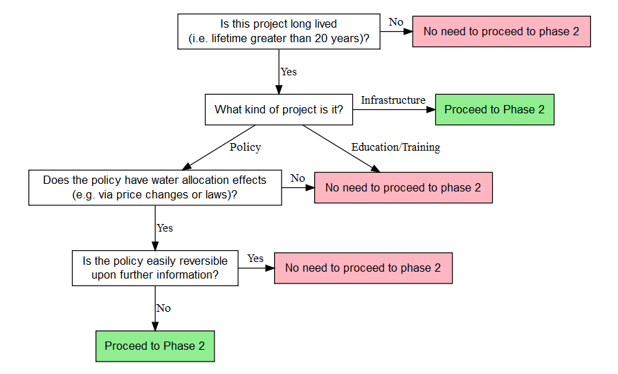

--- 
title: '`r paste0(input$title, ": ", "Climate Screening Worksheet")`' 
date: '`r format(Sys.Date(), "%B %d, %Y")`'
output: 
  pdf_document:
    latex_engine: xelatex
---

```{r setup, include=FALSE} 
knitr::opts_chunk$set(echo = FALSE) 
library(shiny)
```

## Project Title: `r input$title`

## Overview

Welcome to Phase 1 of the Decision Tree Framework: the Climate Screening Worksheet. This
worksheet will help you determine if the project under consideration requires a
Phase 2 analysis.

**The primary purpose of Phase 1 is to provide notes and keywords that justify the classification you eventually choose for this project.** This will necessarily include a thoughtful reflection and analysis of your project. The Four C's provide strategic questions to guide your thinking.  You are encouraged to add or remove particular questions based on their relevance to the project. **No response in a particular text box need exceed 100 words for Phase 1 to be completed sucessfully.**

After you have spent some time reflecting on the project, fill out the basic
questions at the bottom of this page to determine whether or not the project
requires a Phase 2 sensitivity analysis. You can then download this page, along
with your responses, for your records.

## Choices:

- What are the design options? 
- Are different system sizes and configurations possible? 
- Are there substitutable parts? 
- Is the project flexible in time or space? 
- Can the project be modular? 
- What is the timing of the project? Can the project be delayed, or must it be initiated immediately? 
- What are the financing options? 
- Is there wide agreement on the choices available?

**Your response:**

`r input$text_choices`

## Consequences: 

- What are the project's benefits and costs, or are other performance indicators primary? 
- How are benefits and costs distributed spatially, temporally, and socioeconomically? 
- How are the project's benefits and costs measured? 
- Can all benefits and costs be monetized? 
- What are the performance thresholds, that is, the criteria for designation as failure or success? 
- What are the windfall possibilities (best case), and what are the worst-case consequences of failure? 
- How might failures be hedged against? 
- Is it possible to assign likelihoods on future scenarios? How might those be
quantified and analyzed? 
- Is there wide agreement on the consequences of the project?

**Your response:**

`r input$text_consequences`

## Connections: 
- How are benefits and costs distributed spatially, temporally, and socioeconomically? 
- How are culture, politics, and environment (among others) affected by this project? Are those effects included in the consequences of the project? 
- Is the success of the project tied to the success of other projects outside the scope of the immediate evaluation? 
- What are the modeling interconnections (that is, what model input must be generated using other models, such as climate model data into hydrologic models, and hydrologic model data into systems models)?
- What are the scheduling interconnections (that is, what other projects must be completed before this project can begin, and what other projects must wait for this project to be completed)?
- Is there wide agreement on the project's interconnections?

**Your response:**

`r input$text_connections`

## unCertainties:
- What are the principal uncertainties (1) in the short term (for example, climate, demographic, economic, and political factors) and (2) in the long term (that is, after the first 10-20 years)?
- Are the uncertainties the result of lack of data or lack of observations, or are they largely irreducible? 
- If the uncertainties can be reduced, how much effort and budget would be required to reduce these uncertainties? 
- Can decisions on the project be delayed until more information is gathered? 
- Is data collection obstructed by matters of national security or secrecy of another kind? 
- How do the uncertainties interact? 
- How might the various uncertainties (principal and minor) be weighted? 
- Are the uncertainties fairly well understood and quantifiable, or would they be better described as "deep"? 
- If trends in available data are discernible, what do the trends indicate, and how well do the historical trends match the projections? 
- Do the various stakeholders agree on the relative significance of the uncertainties? 
- Can a probability distribution be fitted to the uncertainties? Can they be modeled statistically?

**Your response:**

`r input$text_uncertainties`

## Is Phase 2 Necessary? 
Answer the questions below until you have recieved a notice that you have completed the worksheet. 
Then download the page for your records.

For your convienience, the flowchart below summarizes the different categories a
project might fall under and whether or not the project requires proceeding to
Phase 2.

**Questions:**

Is this project long lived (i.e. lifetime greater than 20 years)? **`r input$lifetime`**

What kind of project is it? **`r input$project_type`**

Does the policy have water allocation effects (e.g., via price changes or laws)? **`r input$water_alloc`**

Is the policy easily easily reversible upon further information? **`r input$reversible`**

```{r result} 
if((input$lifetime == 'No') | (input$lifetime == 'Yes' &
input$project_type == 'Other') | (input$lifetime == 'Yes' & input$project_type
== 'Policy' & input$water_alloc == 'No') | (input$lifetime == 'Yes' &
input$project_type == 'Policy' & input$water_alloc == 'Yes' & input$reversible
== 'Yes')) { p("Based on your evaluation,", tags$strong("there is no need to
proceed to Phase 2 for this project.")) }

if((input$lifetime == 'Yes' & input$project_type == 'Infrastructure') | 
(input$lifetime == 'Yes' & input$project_type == 'Policy' & input$water_alloc ==
'Yes' & input$reversible == 'No')){ strong("Based on your evaluation,", "this
project requires a Phase 2 sensitivity analysis.") }
```

```{r chart}
#get_flowchart() causes error. Not sure why. This means that you'll have to rebuild the flowchart everytime you make a change in the flowchart.R file...
```


